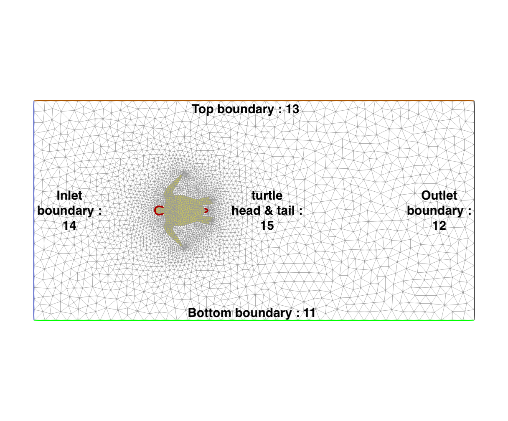
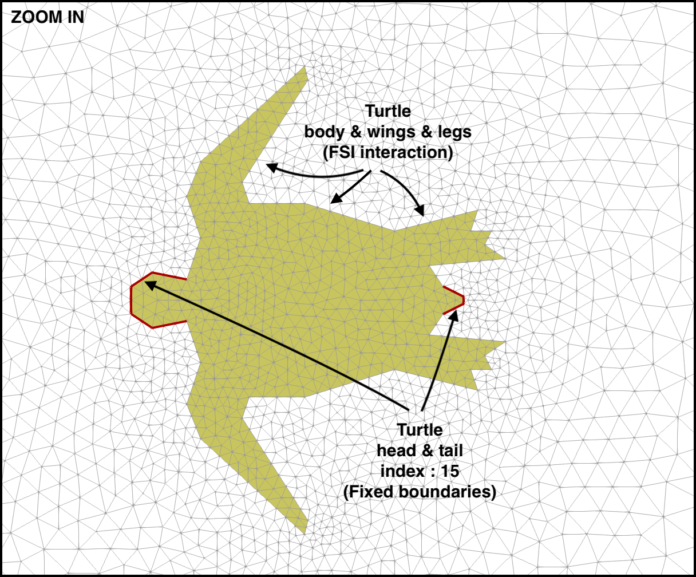
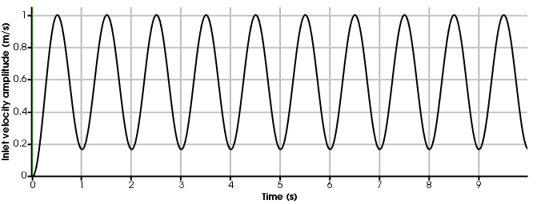
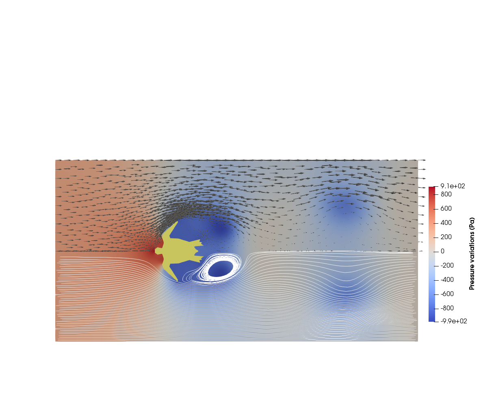

.. title:: Using turtleFSI

.. _using_turtleFSI:

===============
Using turtleFSI
===============

Execute a run
=============

turtleFSI is aimed to be user friendly, where all parameters can be controlled from the command line.
In this page, we provide an example on how to create your own problem file. First a quick recap on how to
execute turtleFSI.

To run turtleFSI with all the default parameters you can execute::
 turtleFSI

or, to run a specific problem file, run::
 turtleFSI --problem [path_to_problem]

To get an overview of all parameters, please run::
 turtleFSI -h

Create your own problem file
============================

The number of problem files in turtleFSI is somewhat limited. We have, therefore, created a step-by-step
explanation, see the below, on how you can create your own problem file.

For all numerical problems we have to specify a set parameters, provide a mesh and boundary conditions,
how to solve the equations, and finally specify which metric we are interested in measuring.
In turtleFSI problem file you can define upto seven functions which provides the solver with
the above mentioned information. Listed in the order they are first executed:

- ``set_problem_parameters``
- ``get_mesh_domain_and_boundaries``
- ``initiate``
- ``create_bcs``
- ``pre_solve``
- ``post_solve``
- ``finished``

set_problem_parameters
~~~~~~~~~~~~~~~~~~~~~~
This function is for defining parameters of the problem like, dt, end time (T), and
physical parameters of the problem. To see a full list of the standard parameters you can change
please refer to the ``default_variables`` defined in ``turtleFSI/problems/__init__.py``.

In ``set_problem_parameters`` you should take the ``default_variables`` as an input,
and update the dictionary with your own values. It is particularly important to
overwrite the physical variables as these vary from problem to problem.

If you provide any command line arguments these will overwrite both those you have defined in your
problem file, and the ``default_variables``. In theory, you do not have to specify the ``set_problem_parameters``
if you just want to use the values defined in ``default_variables``, however in practice you have to
include this function in all your problem files.

A simple example of this function can look like this::

    def set_problem_parameters(default_variables, **namespace):
        # Overwrite default values
        default_variables.update(dict(
            T=15,                          # End time [s]
            dt=0.005,                      # Time step [s]
            theta=0.505,                   # theta value (0.5 + dt), shifted Crank-Nicolson scheme
            Um=1.0,                        # Max. velocity inlet [m/s]
            rho_f=1.0E3,                   # Fluid density [kg/m3]
            mu_f=1.0,                      # Fluid dynamic viscosity [Pa.s]
            rho_s=1.0E3,                   # Solid density [kg/m3]
            mu_s=5.0E4,                    # Solid shear modulus or 2nd Lame Coef. [Pa]
            lambda_s=4.5E5,                # Solid 1st Lame Coef. [Pa]
            nu_s=0.45,                     # Solid Poisson ratio [-]
            dx_f_id=1,                     # ID of marker in the fluid domain
            dx_s_id=2,                     # ID of marker in the solid domain
            extrapolation="biharmonic",    # laplace, elastic, biharmonic, no-extrapolation
            extrapolation_sub_type="constrained_disp",  # ["constant", "small_constant", "volume", "volume_change", "constrained_disp", "constrained_disp_vel"]
            recompute=15,                  # recompute the Jacobian matrix every "recompute" Newton iterations
            folder="turtle_demo_results"), # name of the folder to save the data
            save_step=1                    # frequency of data saving
         )
         return default_variables

get_mesh_domain_and_boundaries
~~~~~~~~~~~~~~~~~~~~~~~~~~~~~~
This function is one of two which is not optional, and have to be provided for the problem file to run.
Here you read or define your mesh, domain markers, and boundary markers. In ``turtle_demo.py`` there
is an example of reading the mesh data from pre-existing ".xdmf" mesh files. In contrast to the
'Turek flag'-example (``TF_fsi.py``), where the domain and boundaries are marked using FEniCS functions.

Any questions regarding how to best create a mesh, we refer to the FEniCS documentation and discourse group, but
``pygmsh`` in combination with ``meshio`` can be relevant tools to create a lot of geometries.

In ``turtle_demo.py``, the function looks like this::

    def get_mesh_domain_and_boundaries(args, **namespace):
        mesh_folder = path.join(path.dirname(path.abspath(__file__)), "..", "mesh", "turtle_demo")

        # In this example, the mesh and markers are stored in the 3 following files
        mesh_path = path.join(mesh_folder, "turtle_mesh.xdmf")     # mesh geometry
        domains_marker_path = path.join(mesh_folder, "mc.xdmf")    # marker over the elements (domains)
        boundaries_marker_path = path.join(mesh_folder, "mf.xdmf") # markers of the segments (boundaries)

        # "mesh" collects the mesh geometry of the entire domain (fluid + solid).
        # In this example, we import a mesh stored in a .xdmf file, but other formats
        # are supported such as .xml files.
        mesh = Mesh()
        xdmf = XDMFFile(MPI.comm_world, mesh_path)
        xdmf.read(mesh)

        # "domains" collects the element markers of the fluid domain (marked as 1)
        # and the solid domain (marked as 2).
        domains = MeshFunction("size_t", mesh, mesh.geometry().dim())
        xdmf = XDMFFile(MPI.comm_world, domains_marker_path)
        xdmf.read(domains)

        # "boundaries" collects the boundary markers that are used to apply the
        # Dirichlet boundary conditions on both the fluid and solid domains.
        # Marker values ranging from 11 to 15.
        mesh_collection = MeshValueCollection("size_t", mesh, mesh.geometry().dim() - 1)
        xdmf = XDMFFile(MPI.comm_world, boundaries_marker_path)
        xdmf.read(mesh_collection)
        boundaries = cpp.mesh.MeshFunctionSizet(mesh, mesh_collection)

        return mesh, domains, boundaries

   Domain boundaries.

initiate
~~~~~~~~
This function is not strictly necessary, but can be used to initiate variables and data files before
entering the time loop of the simulation. In ``turtle_demo.py``, the function is used to initialize
the files where the data are stored during the simulation::

    def initiate(dvp_, folder, **namespace):
        # Files for storing results
        u_file = XDMFFile(MPI.comm_world, path.join(folder, "velocity.xdmf"))
        d_file = XDMFFile(MPI.comm_world, path.join(folder, "d.xdmf"))
        p_file = XDMFFile(MPI.comm_world, path.join(folder, "pressure.xdmf"))

        for tmp_t in [u_file, d_file, p_file]:
            tmp_t.parameters["flush_output"] = True
            tmp_t.parameters["rewrite_function_mesh"] = False

        # Extract the variables to save
        d = dvp_["n"].sub(0, deepcopy=True)
        v = dvp_["n"].sub(1, deepcopy=True)
        p = dvp_["n"].sub(2, deepcopy=True)

        # Save the data to the simulation time=0.0
        d_file.write(d, 0.0)
        u_file.write(v, 0.0)
        p_file.write(p, 0.0)

        return dict(u_file=u_file, d_file=d_file, p_file=p_file)

create_bcs
~~~~~~~~~~
The function ``create_bcs`` is used to define the boundary conditions of the problem to be solved,
and is required for the problem file to run. In ``turtle_demo.py``, the inlet boundary condition
is defined the ``Inlet`` class, which inherits the FEniCS ``UserExpression`` class.
This class is then used in the function ``create_bcs`` to prescribe Dirichlet boundary condition to the
inlet velocity. When defining the boundary conditions to specific domain regions or boundaries, make sure to
be consistent with the markers provided in ``get_mesh_domain_and_boundaries``::

    class Inlet(UserExpression):
        def __init__(self, Um, **kwargs):
            self.t = 0.0
            self.t_ramp = 0.5  # time to ramp-up to max inlet velocity (from 0 to Um)
            self.Um = Um       # Max. velocity inlet [m/s]
            super().__init__(**kwargs)

        def update(self, t):
            self.t = t
            if self.t < self.t_ramp:
                self.value = self.Um * np.abs(np.cos(self.t/self.t_ramp*np.pi)-1)/2  # ramp-up the inlet velocity
                print(self.value)
            else:
                Um_min = self.Um/6  # lower velocity during oscillations
                self.value = (self.Um-Um_min) * np.abs(np.cos(self.t/self.t_ramp*np.pi)-1)/2 + Um_min
                print(self.value)

        def eval(self, value, x):
            value[0] = self.value
            value[1] = 0

        def value_shape(self):
            return (2,)

    def create_bcs(DVP, boundaries, Um, v_deg, extrapolation_sub_type, **namespace):
        if MPI.rank(MPI.comm_world) == 0:
            print("Create bcs")

        inlet = Inlet(Um, degree=v_deg)
        noslip = ((0.0, 0.0))

        # Segments indices (make sure of the consistency with the boundary file)
        bottom_id = 11  # segments at the bottom of the model
        outlet_id = 12  # segments at the outlet (right wall) of the model
        top_id = 13     # segments at the top (right wall) of the model
        inlet_id = 14   # segments at the inlet (left wall) of the model
        turtle_head_tail_id = 15   # segments along the head and tail of the turtle

        # Fluid velocity boundary conditions
        u_inlet = DirichletBC(DVP.sub(1), inlet, boundaries, inlet_id)
        u_bot = DirichletBC(DVP.sub(1).sub(1), (0.0), boundaries, bottom_id)
        u_top = DirichletBC(DVP.sub(1).sub(1), (0.0), boundaries, top_id)
        u_head_tail = DirichletBC(DVP.sub(1), noslip, boundaries, turtle_head_tail_id)

        # Pressure boundary conditions
        p_outlet = DirichletBC(DVP.sub(2), (0.0), boundaries, outlet_id)

        # List boundary conditions for the fluid
        bcs = [u_bot, u_top, u_inlet, p_outlet, u_head_tail]

        # Mesh uplifting boundary conditions
        d_inlet = DirichletBC(DVP.sub(0), noslip, boundaries, inlet_id)
        d_bot = DirichletBC(DVP.sub(0), noslip, boundaries, bottom_id)
        d_top = DirichletBC(DVP.sub(0), noslip, boundaries, top_id)
        d_outlet = DirichletBC(DVP.sub(0), noslip, boundaries, outlet_id)
        d_head_tail = DirichletBC(DVP.sub(0), noslip, boundaries, turtle_head_tail_id)

        # Add boundary conditions for the structure
        bcs += [d_bot, d_top, d_outlet, d_inlet, d_head_tail]:

        return dict(bcs=bcs, inlet=inlet)

    FSI and Fixed boundaries.

   Inlet velocity amplitude variation with time as defined by the class Inlet().

pre_solve
~~~~~~~~~
This function is called within the time loop of the simulation before calling the solver
at the given time step. In ``turtle_demo.py``, we used this function to update the time variable of the
``Inlet`` expression used for the inlet boundary conditions::

    def pre_solve(t, inlet, **namespace):
        # Update the time variable used for the inlet boundary condition
        inlet.update(t)

post_solve
~~~~~~~~~~~
This function is called within the time loop of the simulation after
calling the solver at the given time step. In ``turtle_demo.py``, we used this function to
save the updated solution vector to the data files initialized in the ``initiate`` function::

    def post_solve(t, dvp_, counter, u_file, p_file, d_file, save_step, **namespace):
        if counter % save_step == 0:
            d = dvp_["n"].sub(0, deepcopy=True)
            v = dvp_["n"].sub(1, deepcopy=True)
            p = dvp_["n"].sub(2, deepcopy=True)
            p_file.write(p, t)
            d_file.write(d, t)
            u_file.write(v, t)

   Pressure and velocity fields at 2.5 s. obtained by running the turtle_demo.py problem file.

finished
~~~~~~~~
Function called once at the end of the time loop. An example of use is given in the
``TF_fsi.py`` where text file are saved to store informations from the simulation::

    def finished(folder, dis_x, dis_y, Drag_list, Lift_list, Time_list, **namespace):
        if MPI.rank(MPI.comm_world) == 0:
            np.savetxt(path.join(folder, 'Lift.txt'), Lift_list, delimiter=',')
            np.savetxt(path.join(folder, 'Drag.txt'), Drag_list, delimiter=',')
            np.savetxt(path.join(folder, 'Time.txt'), Time_list, delimiter=',')
            np.savetxt(path.join(folder, 'dis_x.txt'), dis_x, delimiter=',')
            np.savetxt(path.join(folder, 'dis_y.txt'), dis_y, delimiter=',')
