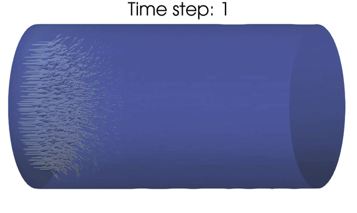
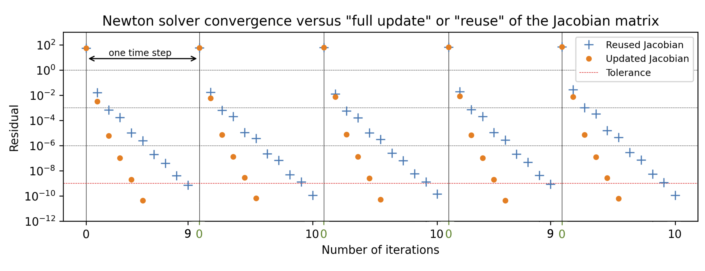

.. title:: Solver verification and performance

.. _verif_perf:

=========================================
Newton solver convergence and performance
=========================================

We illustrate the solver convergence and performance of turtleFSI with a 3D FSI pipe flow problem
(animation below). We impose a constant Dirichlet plug flow at one end of the fluid domain and
compute the resulting structure deformation and fluid flow along the pipe.

   Animation of the problem used for benchmarking convergence and performance.

Solver convergence
~~~~~~~~~~~~~~~~~~
The robustness of turtleFSI relies on the use of a direct solver (here, MUMPS) within each Newton
iterations. Using a direct solver for large 3D problems can rapidly become computationally
demanding. Indeed, most of the computational cost of turtleFSI is spent to perform the factorization
of the linear system at each Newton iterations. To mitigate this limitation, we can reuse the same
factorization over several iterations by not updating the Jacobian matrix of the problem. This can
typically be done in simulations where the Newton iterations exhibit “good” converge behavior. In
turtleFSI, the reuse of the Jacobian matrix can be set by the flags ``recompute``, which takes
an integer and controls how many iterations reusing the same Jacobian matrix in the same timestep. 
``recompute_tstep``, does the same, but controls how many time steps to take reusing the same
Jacobian matrix.

.. note::
   Any increase of the relative or absolute residual will trigger turtleFSI to recompute the
   Jacobian matrix, irrespective of the prescribed user values set by the ``recompute`` and
   ``recompute_tstep``.  

Figure 1 illustrates the convergence of the solver using the full Newton procedure, updating the
Jacobian matrix at each iteration step versus reusing the Jacobian matrix over the iterations
(and the time steps). Reusing the Jacobian matrix leads to a larger number of iterations per time
steps, typically ~10 iterations instead of ~5 when updating the Jacobian matrix, but the compute
time is drastically reduced from ca. 20 min. to only 25 s. per time step. The results were produced
with an AMD CPU Ryzen 5 1600, using 12 threads.

    **Figure 1**: Comparison of the convergence behavior of the Newton procedure when updating or
    reusing the Jacobian matrix. The residuals are plotted for the time steps 31 to 36 of the 3D
    FSI pipe flow problem (see above animation). The average execution time for each time step with
    updated Jacobian is 1170 seconds and 25 seconds for the reused Jacobian. 

HPC performance
~~~~~~~~~~~~~~~
turtleFSI benefits from the high-performance computing (HPC) functionality of FEniCS and the solver
can be executed with MPI parallel tasks as follow without any addition to the code::

  mpirun -np 4 turtleFSI

We performed a strong scaling of a 3D FSI pipe flow to illustrate the behavior of the solver using a
relatively large number of parallel MPI tasks. We present the results obtained at the second time step
of the simulation starting from initial rest. We demonstrate an adequate scaling using up to 64 cores
of one cluster node, both executing turtleFSI from a module installation or within a docker container
(Figure 2c). A direct consequence of splitting the geometry in several MPI domains (Figure 2b) is an
increase of the system size associated with the handling of the degree of freedoms along the inner
split boundaries. We illustrate this effect in Figure d where the total memory usage is monitored as
function of the number of MPI tasks used to solve the problem. In our example, we reuse the Jacobian
matrix and the factorization of the direct solver over five Newton’s iterations. As shown in Figure 2c,
the total execution time for computing the Jacobian matrix once and factorization of the system is about
two orders of magnitude larger than solving five iteration steps by reusing the factorization.

.. figure:: ../../figs/figure_HPC.png
    :width: 600px
    :align: center

    **Figure 2**: Strong scaling of a 3D FSI pipe flow problem. a) Meshing of the inner fluid domain, and
    outer solid pipe with a total of 63 thousand elements. b) Split of the geometry in 16 MPI domains.
    c) Total time spent for one time step (jac.: Jacobian matrix evaluation, fact.: direct solver
    factorization step, it.: direct solver solve steps) as function of the number of MPI tasks. d)
    System memory usage as function of the number of MPI tasks for three different mesh discretizations
    of the problem illustrated in panel a).

