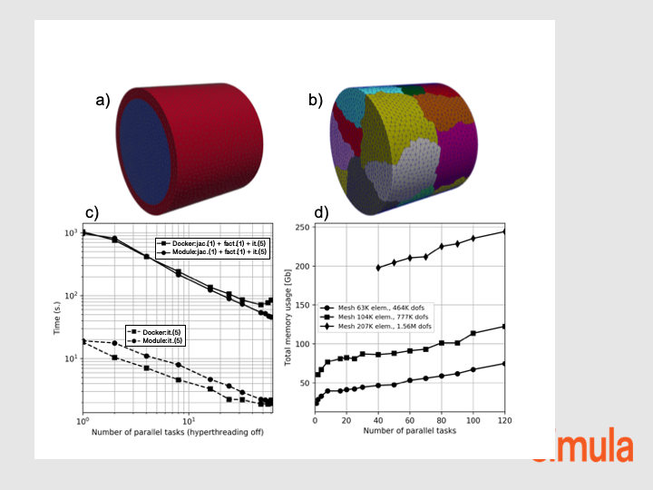

.. title:: Solver verification and performance

.. _verif_perf:

==================
Solver performance
==================

turtleFSI benefits from the high performance computing (HPC) functionability
of FEniCS and the solver can be executed with MPI parallel tasks as follow::

 mpirun -np 4 turtleFSI

We performed a strong scaling of a 3D FSI pipe flow (Figure a-b) to illustrate the behaviour of the
the solver using a relatively large number of parallel MPI tasks. The simulation consists at imposing
a constant Dirichlet plug flow at one end of the fluid domain and compute the resulting structure
deformation and fluid flow along the pipe. We present the results obtained at the second time step
of the simulation starting from initial rest.
We demonstrate an adequate scaling using up to 64 cores of one cluster node, both executing
turtleFSI from a module installation or within a docker container (Figure c).
A direct consequence of splitting the geometry in several MPI domains (Figure b) is an increase of
the system size associated with the handling of the degree of freedoms along the
inner split boundaries. We illustrate this effect in Figure d where the total memory usage
is monitored as function of the number of MPI tasks used to solve the problem.
In the simulation, most of the time is spent in the factorization step within the direct solver (MUMPS)
every time a new Jacobian matrix is evaluated. Therefore, reusing the Jacobian matrix over
several Newton's iterations can be an efficient strategy if the solution shows a good convergence rate.
In our example, we reuse the Jacobian matrix and the factorization of the direct solver over 5 Newton's iterations.
As shown in Figure c, the total time in computing once the Jacobian matrix and
the factorisation of the system is about 2 orders of magnitude larger than solving 5 iteration steps by reusing the factorisation.

    Figure: Strong scaling of a 3D FSI pipe flow problem. a) Meshing of the inner fluid domain,
    and outer solid pipe with a total of ca. 63000 elements. b) Split of the geometry in
    16 MPI domains. c) Total time spent for one time step (jac.: jacobian matrix evaluation,
    fact.: direct solver factorization step, it.: direct solver solve steps) as function of the number of MPI tasks.
    Results obtained with a mesh discretization of 63000 elements.
    d) System memory usage as function of the number of MPI tasks for 3 different mesh discretizations
    of the problem illustrated in a).
